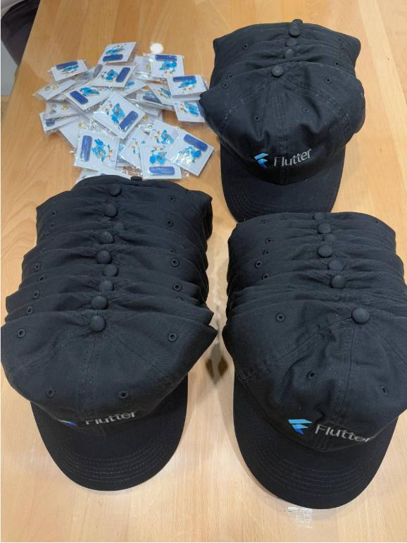

# Flutter 小聚 #24


---

# 小聚說明

- 主辦社群: **GDG Taipei**、**Flutter Taipei**
- 原則上一個月會舉辦一次，時間會在當月**最後一週的週二**
- 地點：**天攏書局 2F**
- 活動主要會分成
  - 當月 Flutter 大小事: 介紹當月 Flutter 相關的大小事
  - 開發者經驗分享: 分享與 Flutter 開發的相關內容，題目不限，可洽志工報名
  - Lightning Talk: 現場/活動事前表單報名，在場有任何想法，可洽志工報名
  - 活動任何問題都可以透過 **Slido** 發問
- 小聚任何行為都參照 GDG 台灣 行為準則 https://gdg.tw/code_of_conduct/
- 下次小聚時間：**2025/05/22**

---


---


---

# Google I/O Extended 2025 Taipei @Google 板橋辦公室


---

# Flutter Taipei 每月月報


---

# 上台分享可獲得一個 Pin 針 及 帽子



---

# Slido


---

# Flutter 五月大小事

## Rainer Fang 

---

# Rainer Fang 

- GDG Taipei Organizer
- Flutter Taipei Organizer
- 專注於 Flutter 的行動應用開發者

---


---

# 摘要總覽

基於 Dart 3.8 版本與 Flutter 3.32 版本，並整合 Google I/O 2025 大會分享的關鍵內容：

- **框架與語言核心：** Dart 語言與 Flutter 框架的新功能與改進。
- **開發者體驗：** 提升生產力的工具與 IDE 整合。
- **平台擴展：** Web, iOS, Android, Desktop 的特定平台增強。
- **原生互通：** 簡化與原生 API 的互動。
- **AI 整合：** 將 AI 能力帶入開發工作流程與應用程式。
- **社群與生態系：** 持續成長的動態與合作夥伴。

---

# Dart 3.8 語言與 SDK 更新

- **Null-aware Elements (`?`)：** 在集合中輕鬆包含非 null 元素。
  ```dart
  var listWithNullAwareElements = [
    if (promotableNullableValue != null) // Before
        promotableNullableValue,
    ?promotableNullableValue, // After
  ];
  ```
- **跨編譯支援：** 從 Windows/macOS 開發環境編譯 Linux 原生執行檔。
  ```bash
  $ dart compile exe --target-os=linux --target-arch=arm64
  ```
- **Doc Imports (`@docImport`)：** 允許在文件註釋中引用未實際導入的外部元素，改善文件連結。

---

# 提升開發者體驗

- **Formatter 智慧調整：** 自動決定分行並管理尾隨逗號，使程式碼更整齊一致。
  ```dart
  // Before
  TabBar(tabs: [Tab(text: 'A'), Tab(text: 'B')], labelColor: Colors.white70);
  // After
  TabBar(
    tabs: [ Tab(text: 'A'), Tab(text: 'B'), ],
    labelColor: Colors.white70,
  );
  ```
- **Pub.dev 更新：** 引入「熱門套件 (Trending Packages)」，幫助發現近期快速成長的套件。

---

- **Flutter Property Editor (新!):** 在 IDE 側邊面板中輕鬆編輯 Widget 屬性並查閱文件 (VS Code, Android Studio/IntelliJ)。


---

# Web 熱重載 (實驗性)

- Flutter Web 應用程式現在支援狀態熱重載，極大加速 Web 開發迭代速度。- **如何啟用：**
- CLI: 運行 `flutter run -d chrome --web-experimental-hot-reload`
- VS Code: 配置 `launch.json` 加入 `--web-experimental-hot-reload` 參數。
- **DartPad 整合：** 熱重載功能也已整合到 DartPad 中。
- **持續改進：** 仍是實驗性功能，積極收集回饋並修復已知問題。


---


# Great on Android

- **Impeller:** 從 3.29.3 版本開始，在 Android API level 28 (Android 9) 及更舊的裝置上使用舊版 Skia renderer。Impeller 仍是 API level 29 (Android 10) 及更新版本的預設 renderer。Opt-out 選項將在即將推出的穩定版本中移除。
- **Edge-to-edge:** 從 Flutter 3.27 開始，Android 的 edge-to-edge UI system 成為 Flutter 的預設設置。
- **Scribe:** 新增對 Android「Scribe」功能的支援，將原始手寫內容轉換為實際文字。
- **Material updates:** 對 Material 進行了多次更新，包括支援新的頁面轉場、更新進度指示器和滑塊等。

---

# Great on iOS

- 旨在讓開發人員為 iOS 構建精美、功能豐富的應用程式。
- **Cupertino update:** 對 Cupertino library 進行了大量投資，以提高其保真度和擴展其覆蓋範圍。
- **Swift Package Manager:** 從 Cocoapods 遷移到 Swift Package Manager 以簡化開發設置，超過 150 個 plugin 已添加支援（包括所有 Firebase plugin）。目標是盡快完成遷移。
- **Cupertino Squircles (新!):** 新增支援 Apple 風格的圓角超橢圓 (RSuperellipse)，提升 iOS UI 的原生保真度。已應用於 `CupertinoAlertDialog`, `CupertinoActionSheet`。

---

# 直接原生互通 (Direct Native Interop)

- **願景：** 使 Flutter 開發者更容易、更直接地訪問平台原生 API。
- **解決方案：**
  - **FFIgen：** 為 Objective-C/Swift API 生成 Dart 綁定。
  - **JNIgen：** 為 Java/Kotlin API 生成 Dart 綁定。
- **優勢：** 支援同步呼叫，更好的 tree-shaking，減少手寫橋接程式碼。
- **早期試用計畫：** FFigen 和 JNIgen 開放早期試用申請，尋找有興趣重構 Plugin 的開發者。


---

# 加入 Interop 早期試用計畫

- 我們正在尋找精通構建 Flutter plugin 和使用 Flutter 工具的候選人，以試用早期試用計畫。
- 您將重寫現有 plugin 以使用直接互通性，並提供詳細意見回饋和問題來指導未來開發。
- 這是一個預覽計畫，會有不可避免的粗糙之處，但我們準備提供支援並提供早期訪問，以克服您遇到的任何障礙。
- 請填寫此[表格](https://docs.google.com/forms/d/e/1FAIpQLScSSBAb0sKsrCFJhXnxbhUWx7bdFbuDqWps5C24KIXdD7E-_Q/viewform?usp=header)表達您的興趣。我們可能無法將所有申請者納入此早期計畫。選定的候選人將在 2025 年 6 月 20 日之後收到我們的通知。

---

# Great on web

- **WebAssembly:** 去年宣布支援將 Flutter web apps 編譯為 WasmGC，以加快應用程式啟動速度並在複雜場景中將 frame 渲染速度提高一倍。
- **Accessibility:** 在無障礙系統方面進行了大量工作（性能），並添加了全新的 Semantics Roles system，Flutter 將其轉換為 web 上的標準 aria labels。
- **Stateful hot reload:** Flutter web 的狀態熱重載現在可在所有 channel 中提供預覽，在大多數情況下與 VM 現有的熱重載實現沒有區別。例如，您可以在 DartPad 中體驗它。

---

# 強化桌面平台支援

- **多視窗支援進展：** Canonical 大幅改進了 Flutter 桌面應用程式的多視窗功能，修復了輔助功能、生命週期、焦點等問題。
- **桌面線程合併：** 在 Windows 和 macOS 上實驗性支援合併 UI 和平台線程 (透過配置啟用)，允許 Dart FFI 直接呼叫平台線程上的原生 API。


# 擴展生態系

- **LG:** 去年宣布計畫使用 Flutter 重寫許多核心 webOS 系統應用程式。今年，LG 顯著擴大了對 Flutter 的投資，目標是完成新的 webOS-Flutter SDK 的開發，允許開發人員將 Flutter 應用程式發布到 LG Content Store。他們計畫在明年上半年正式推出。

---


# Breaking changes and deprecations

- **Android accessibility announcements:** 在 Android 上，`AnnounceSemanticsEvent` 事件已[棄用，從 API 36 開始](https://api.flutter.dev/flutter/semantics/AnnounceSemanticsEvent-class.html#android)。請改用配置 `SemanticProperties.liveRegion` 的「polite」隱式公告。
- **停止支援 6 個套件：** 如我們在 [Flutter 3.29 release blog post](https://medium.com/flutter/whats-new-in-flutter-3-29-f90c380c2317) 中計畫和分享的，我們已停止支援以下套件：flutter_markdown, ios_platform_images, css_colors, palette_generator, flutter_image, flutter_adaptive_scaffold。

---

# Breaking changes and deprecations (Cont.)

- **iOS 和 macOS 最低版本：** Flutter 將在下一個穩定版本中棄用對 iOS 12 和 macOS 10.14 (Mojave) 的支援，並將目標設定為最低支援 iOS 13 和 macOS 10.15 (Catalina)。
- **其他 breaking changes 和 deprecations 包括：**
  - `ExpansionTileController` 在 Material 中已棄用，偏好 Widgets 層中的新的可重用 `ExpansibleController`。
  - `SelectionChangedCause.scribble` (已棄用) 已重命名為 `SelectionChangedCause.stylusHandwriting`。

---

# Breaking changes and deprecations (Cont.)

- **其他 breaking changes 和 deprecations (Cont.)：**
  - `ThemeData.indicatorColor` 已棄用，偏好 `TabBarThemeData.indicatorColor`。`cardTheme`, `dialogTheme`, `tabBarTheme` 的 component theme types 需要遷移到 `CardThemeData`, `DialogThemeData`, `TabBarThemeData`。
  - 已更正某些行為中 `SpringDescription` 的公式。此更改修復了某些參數組合行為與預期物理不符的問題。這會影響 mass 值不是 1 的 underdamped springs。

- 查看 [breaking changes page](https://docs.flutter.dev/release/breaking-changes) 以獲取所有 deprecations 或 breaking changes 的遷移指南。更新後運行 `dart fix` 將自動遷移其中一些更改。

---

### 整合 AI 到應用程式中

- **Firebase AI Logic (新!):** 結合 Vertex AI 和 Gemini Developer API，提供單一 Dart SDK 直接從 Flutter 應用程式中訪問 Gemini 和 Imagen 模型。
- **AI Monitoring dashboard (Firebase):** 在 Firebase console 提供詳細的 Gemini API 使用洞察，協助偵錯和優化。


---

# 整合 AI 到開發工作流程

- **Gemini in Android Studio / 其他 IDEs：** 為 Dart 和 Flutter 開發提供一流的 Gemini 支援，包含程式碼生成、解釋、修正等功能。
- **Model Context Protocol (MCP) 支援：** 正在開發支援 MCP，使 AI Agents 能更準確、相關地理解和互動 Dart/Flutter 工具鏈，實現更智能的程式碼生成和複雜任務處理。


---

# Gemini in Android Studio now speaks fluent Flutter!

- 使用簡單的 prompt 生成 UI code：描述您想要的 UI，Gemini 可以生成相應的 Flutter code。
- 立即修復布局錯誤：Gemini 可以分析您的布局，識別問題，並建議 (甚至自動應用) 修正。
- 解釋複雜的 widgets：不確定特定 widget 的工作原理？Gemini 可以提供清晰的解釋並引導您查看相關文件。


---

# 總結與展望

- Flutter 和 Dart 持續增長勢頭，獲得 Apptopia 等機構肯定。
- 大量客戶案例展示 Flutter 在各行業的應用 (NotebookLM, Google Cloud, Universal, GE Appliances...)。
- 社群貢獻是 Flutter 成功的基石 (Flutter 3.32 有 156 位貢獻者)。
- 鼓勵您升級到最新版本，體驗新功能 (Web 熱重載, Squircles, AI 整合等)。
- 積極參與原生互通早期試用計畫。
- 您的回饋對於 Flutter 和 Dart 的未來發展至關重要！

**立即執行 `flutter upgrade`!**

---

# 其他趣聞

---

# Google Play 個人帳戶浪費了我 42 天的人生 😫

這是一位 solo 開發者在 Google Play 發布 App 的慘痛經歷。

使用個人帳戶：**重大錯誤**

- 第一次嘗試：
  - 等待驗證 (14 天)
  - 預驗證 (5 天)
  - 找 12 位測試者
  - 最終審查 (14 天)
- 結果：App 被拒絕，原因不明。

---

# Google Play 個人帳戶浪費了我 42 天的人生 😫

- 反覆修改、提交、被拒絕，耗時 **3 個月**。
- **解決方案**：
  - 朋友建議使用 **企業帳戶**。
  - 支付 $25，使用企業帳戶上傳**同一個 App**。x
  - **3 天內通過審核**，無需修改！
> **給開發者的建議：**
> 1. 跳過個人帳戶。
> 2. 企業帳戶費用相同 ($25)。
> 3. Google 更認真對待企業帳戶。
> 4. 節省你的時間和精力。

[文章連結](https://www.reddit.com/r/FlutterDev/comments/1kr5i7z/google_play_personal_account_wasted_42_days_of_my/)

---

# Rockstar Games 正在招募 Flutter 工程師！

> 「只是另一個證明 Flutter 已經死了的證據。」

[文章連結](https://www.reddit.com/r/FlutterDev/comments/1kgxwro/in_case_if_you_missed_it_rockstar_games_in/)

---

# 🔥 我整理了 80 個 Flutter 技巧到一個網頁上

- 過去 3 年，我累積了 250 多個 Flutter 技巧。
- 定期在 X 和 LinkedIn 分享。
- 應要求，現在這些技巧可在網頁上閱讀：

[點此閱讀所有技巧](https://apparencekit.dev/flutter-tips/)

- 其他技巧將陸續加入。

[文章連結](https://www.reddit.com/r/FlutterDev/comments/1klhp49/i_compiled_80_flutter_tips_into_a_web_page/)

---

# NotebookLM 是用 Flutter 開發的！

- NotebookLM 不是一個小型或基礎的 App。
- 它是 Gemini 平台的核心應用之一 🤓！
- [@FlutterDev 在 X 的貼文](https://x.com/FlutterDev/status/1924884357371568570?t=eehL-81jyC8-2GQatxf7tw&s=09)
- [Facebook Group 討論](https://www.facebook.com/groups/flutter.taipei/posts/4098063067127286/)

[文章連結](https://www.reddit.com/r/FlutterDev/comments/1ks2f64/notebooklm_was_made_with_flutter/)

---

# 在 2025 年，Flutter 仍然是桌面應用程式的安全選擇嗎？

- Flutter 路線圖顯示 Google 更專注於行動和網頁平台。
- 桌面支援似乎主要由 Canonical 推動。

---

# 在 2025 年，Flutter 仍然是桌面應用程式的安全選擇嗎？

- 考慮 Flutter 跨平台桌面開發 (Windows/macOS/Linux)，它仍是未來可行的選擇嗎？
- 喜歡 Flutter 的開發體驗，但擔心非行動平台的長期支援。
- **正在開發桌面應用程式的開發者怎麼看？** 是全力投入 Flutter 還是關注 Electron 或原生開發？

> **側記：**
> 提及正在開發的工具 [Dualite Alpha](https://www.dualite.dev/)，可將 Figma 設計轉換為前端程式碼。
> 這突顯了不同框架產生的程式碼結構差異，顯示技術領域的碎片化。

[文章連結](https://www.reddit.com/r/FlutterDev/comments/1kq7jzx/is_flutter_still_a_safe_bet_for_desktop_apps_in/)

---

# 宣布 Appwrite Sites - 開源的 Vercel 替代方案，完全支援建立和部署 Flutter Web 🚀

- Appwrite 團隊發布新產品 Appwrite Sites。
- 允許在 Appwrite 內部部署和託管網站和網頁應用程式。
- 完全原生支援建立、託管和擴展任何 Flutter Web App。
- 所有功能 (靜態網站、SSR App、資料庫、驗證、儲存、訊息、無伺服器函數) 都在一個地方。

[文章連結](https://www.reddit.com/r/FlutterDev/comments/1kr4uls/announcing_appwrite_sites_the_open_source_vercel/)

---

# Thank You!

<br />
<br />

###### 本投影片採用
 <a href="https://creativecommons.org/licenses/by-sa/4.0/deed.zh-hant" target="_blank">創用 CC「姓名標示-相同方式分享 4.0 國際」授權條款</a>釋出
 <a href="https://marp.app/" target="_blank">Marp</a> 製作